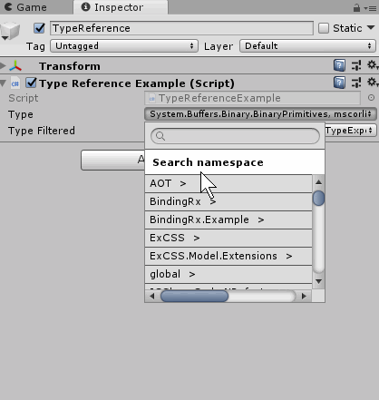
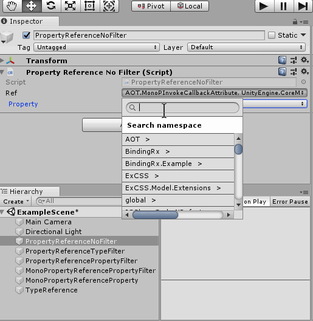
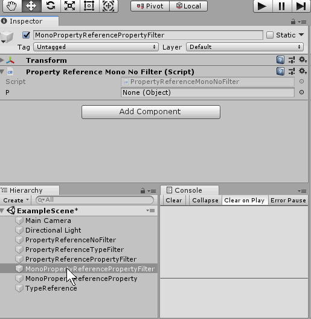

# TypeInspector
Package for unity3d which allow select type and members from editor inspector.  

## Features
 * Type inspector
 * Property inspector
 * GameObject component members inspector
 * Type, members and object filtering using attributes
 * Select method on GameObject/MonoBehaviour
 
## Examples
All examples place in `%PackageFolder%/Examples`. There is example scene and MonoBehaviour components with usage this package.

### TypeReference usage
```csharp
public class TypeReferenceExample : MonoBehaviour
{
    public TypeReference type;
    
    [TypeFilter(nameof(FilterTypePredicate))]
    public TypeReference typeFiltered;
    
    public bool FilterTypePredicate(Type type)
    {
        return type.FullName.StartsWith("TypeInspector");
    }

    public void Start()
    {
        Debug.Log(typeFiltered.FullName);
    }
}
```
All types:  


Filtering:  


### PropertyReference usage
```csharp
public class PropertyReferenceNoFilter : MonoBehaviour
{
    public PropertyReference Ref;
}
```


### MonoPropertyReference usage
```csharp
public class PropertyReferenceMonoNoFilter : MonoBehaviour
{
    public MonoPropertyReference P;
}
```


## Using
For start using this package add lines into `./Packages/manifest.json` like next sample:  
```json
{
  "dependencies": {
    "type-inspector": "https://github.com/k0dep/type-inspector.git#1.0.0"
  }
}
```
Instead `#1.0.0` paste version what you need.